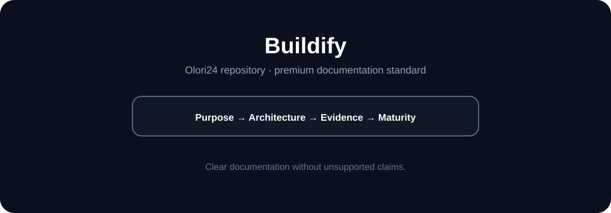

# Buildify

**Project workspace; implementation status must follow repository evidence.**

> **Repository status:** Documentation upgraded. Runtime maturity is stated only where implementation or verification evidence exists.

## Documentation standard

This repository follows the premium README standard established for NSMS: clear positioning, visual orientation, architecture, evidence language, maturity tracking and roadmap separation.

| Evidence label | Meaning |
|---|---|
| **IMPLEMENTED** | Present in the repository. |
| **TESTED** | Supported by an executed test or CI result. |
| **DEPLOYED** | A deployment target/configuration exists. |
| **VERIFIED IN PRODUCTION** | Confirmed with production evidence. |
| **MEASURED** | Backed by an actual measurement. |
| **ROADMAP** | Planned work, not shipped capability. |

---

# buildify-e26340cf-b070-4665-ba8a-424d27c84b44
